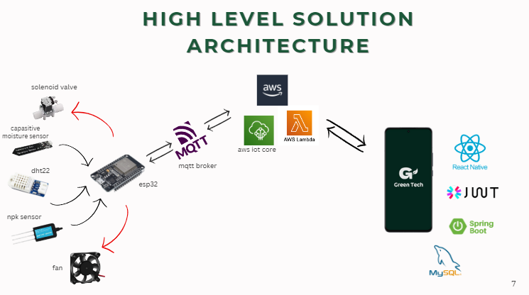
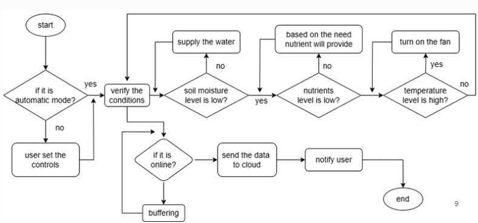

# 🌿 IoT-Based Smart Greenhouse Automation System

## 📖 Introduction

Greenhouse farming plays a crucial role in modern agriculture, enabling year-round cultivation, improved crop yields, and better resource management. However, traditional greenhouse systems require constant human monitoring and intervention, leading to inefficiencies and labor-intensive processes.

This project aims to develop an **IoT-based Smart Greenhouse Automation System** to optimize environmental conditions, enhance productivity, and minimize manual intervention.

---

## 🚀 Features

- **Remote Monitoring & Control**  
  Mobile app integration for real-time access and adjustments.

- **Automatic Irrigation Control**  
  Irrigation automatically adjusts based on soil moisture levels.

- **Automatic Nutrient Control**  
  Nutrients are dispensed as needed based on environmental and crop conditions.

- **Data Analysis and Summary**  
  The system analyzes historical data and provides useful summaries for better decision-making.

---

## 🛠️ Implementation

A demo video is available to illustrate the working system:  
📹 [Demo Video](./docs/video/demo.mp4)

---

## 🧠 Solution Architecture

### High-Level Architecture  


### Control Flow  


---

## 🔧 Hardware & Software

### Hardware Components

1. ESP32  
2. Soil Moisture Sensor  
3. Temperature and Humidity Sensor (DHT22)  
4. Solenoid Valve  
5. Nutrient Pump  
6. NPK Sensor  
7. Fan  
8. Relay  

### Software Stack

1. React Native – Mobile application  
2. Spring Boot – Backend services  
3. MySQL – Database  
4. AWS IoT Core – Cloud communication and device management  

---

## 💰 Budget

| Component                | Quantity | Unit Price (LKR) | Total Price (LKR) |
| ------------------------ | -------- | ---------------- | ----------------- |
| ESP32                    | 2        | 1490             | 2980              |
| DHT22                    | 2        | 590              | 1180              |
| Relay Module             | 2        | 590              | 1180              |
| Soil Moisture Sensor     | 2        | 690              | 1380              |
| NPK Sensor               | 1        | 19,500           | 19,500            |
| Mini Submersible Pump    | 2        | 780              | 1560              |
| Solenoid Valve           | 1        | 1,950            | 1,950             |
| Fan                      | 1        | 720              | 720               |
| Wires and Connectors     | -        | -                | 500               |
| Power Supply             | 2        | 800              | 1600              |
| Breadboard               | 2        | 400              | 800               |
| Jumper Wires             | -        | -                | 300               |
| Tubes for Water/Nutrient | -        | -                | 400               |
| PVC for Box (Casing)     | -        | -                | 500               |
| Miscellaneous            | -        | -                | 700               |
| TOTAL                                                  | 34,250            |

---

## 📱 Mobile App

The mobile app developed using **React Native** allows users to:
- Monitor live sensor data
- Trigger irrigation or nutrient pumps
- View summarized analytics and control settings

---

## ☁️ Cloud & Connectivity

- Uses **AWS IoT Core** for device communication and MQTT protocol for real-time messaging.
- Device data is sent to the backend and stored in **MySQL** for analysis.

---

## 📌 Conclusion

This system automates and modernizes greenhouse management by integrating IoT, cloud computing, and mobile technologies. It offers a scalable, efficient solution for smart agriculture.

---

## 📂 Repository Structure

```plaintext
├── code/Backend-End/            # Spring Boot backend
├── code/Front-EndMobileApp/     # React Native frontend
├── code/ESP32/                  # ESP32 firmware
├── demonstrationDesign/         # Demo designs
└── README.md
